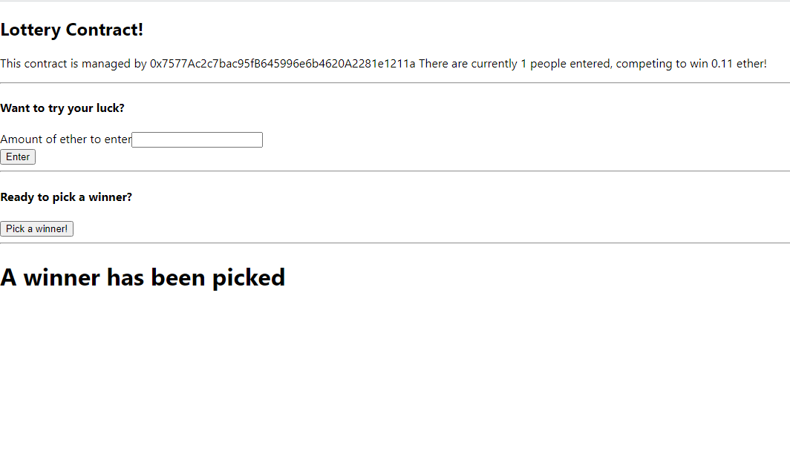

# Lottery Smart Contract

## Built With

- Solidity 0.4.17
- Javascript
- React
- ReactDOM
- Web3 1.0.0-beta.26
- Rinkeby Test Network
- Metamask Wallet

## Author

- 👤GitHub: [Jose Abel Ramirez](https://github.com/jose-Abel)
- Linkedin: [Jose Abel Ramirez Frontany](https://www.linkedin.com/in/jose-abel-ramirez-frontany-7674a842/)

## Getting Started

## Live version

### Setup

## 📝 License

This project is MIT licensed.

## Show your support

Give a ⭐️ if you like this project!
